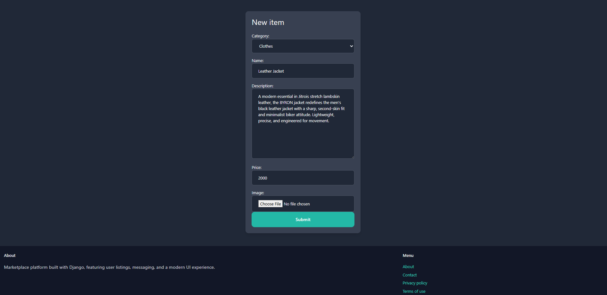
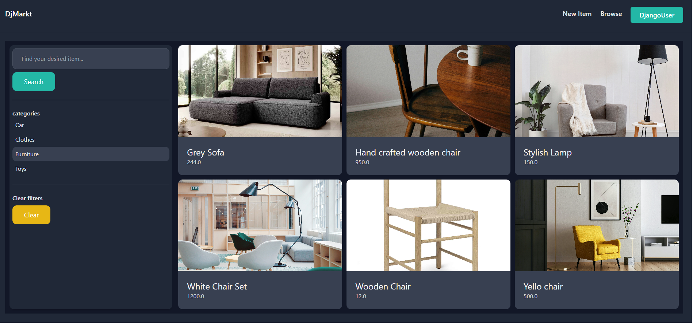
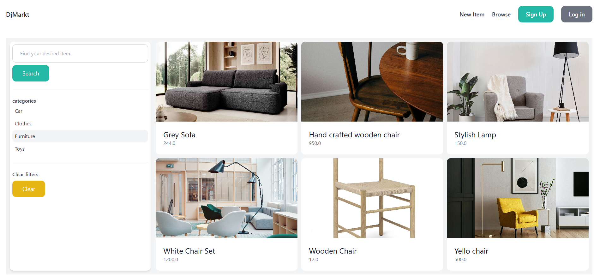
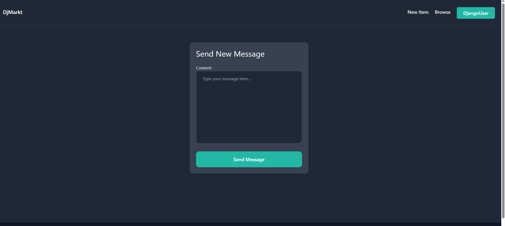

# Django Marketplace (Kleinanzeigen-like Platform)

A full-stack Django marketplace web application inspired by platforms like Kleinanzeigen, enabling users to create listings, communicate, and interact through a structured marketplace system.

---

## 🚀 Overview

This project is a modular Django-based marketplace where users can:

- Create and manage accounts
- Post product listings with images and descriptions
- Communicate with other users via an integrated messaging system
- Explore listings in a structured marketplace interface
- Switch between dark and light UI modes

---

## 🧩 Core Features

### 👤 User System
- Registration and authentication
- Profile management
- Session handling and security features

### 🛒 Marketplace
- Create product listings
- Upload images
- Add product descriptions and details
- Browse listings from other users

### 💬 Messaging System
- Direct user-to-user communication
- Context-based conversations around listings

### 🎨 UI / UX
- Dark mode & light mode support
- Tailwind CSS-based responsive design

---

## 🏗️ Architecture

The project follows a modular Django structure:

- `dashboard/` – user dashboard and overview
- `conversation/` – messaging system
- `cart/` – shopping and order logic (in development)
- `email/` – email handling system
- `users/` – authentication and profiles
- `core/` – shared utilities and configuration

---

## 🧪 Development Status

- Authentication system: completed
- Messaging system: completed
- Product listing system: completed
- Cart & Stripe payments: in progress
- Webhook integration: planned

---

## 🛠 Tech Stack

- Python / Django
- Django Ninja (API layer)
- Tailwind CSS
- SQLite (development)
- Stripe (planned integration)
- uv / pyproject-based dependency management

---

## 🖼️ Screenshots

### Add Product

### Dark Mode Filter Products

### Light Mode Filter Products

### Message Seller

## 🌱 Roadmap

See `FEATURE_ROADMAP.md` for detailed development progress and planned features including:

- Stripe payment integration
- Checkout flow
- Webhook handling
- Frontend checkout experience

---

## 👤 Author

Fraz Ahmad  
GitHub: https://github.com/kfraz93